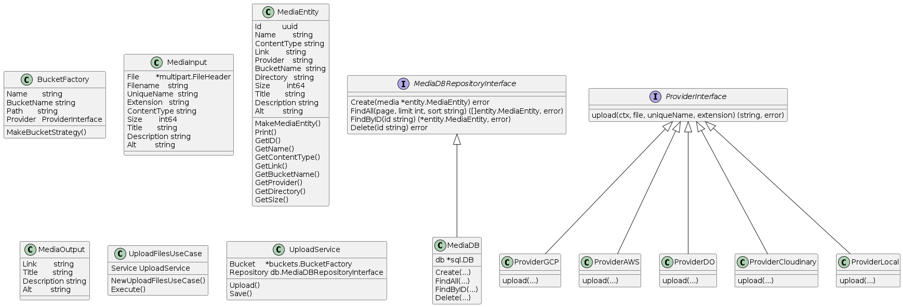
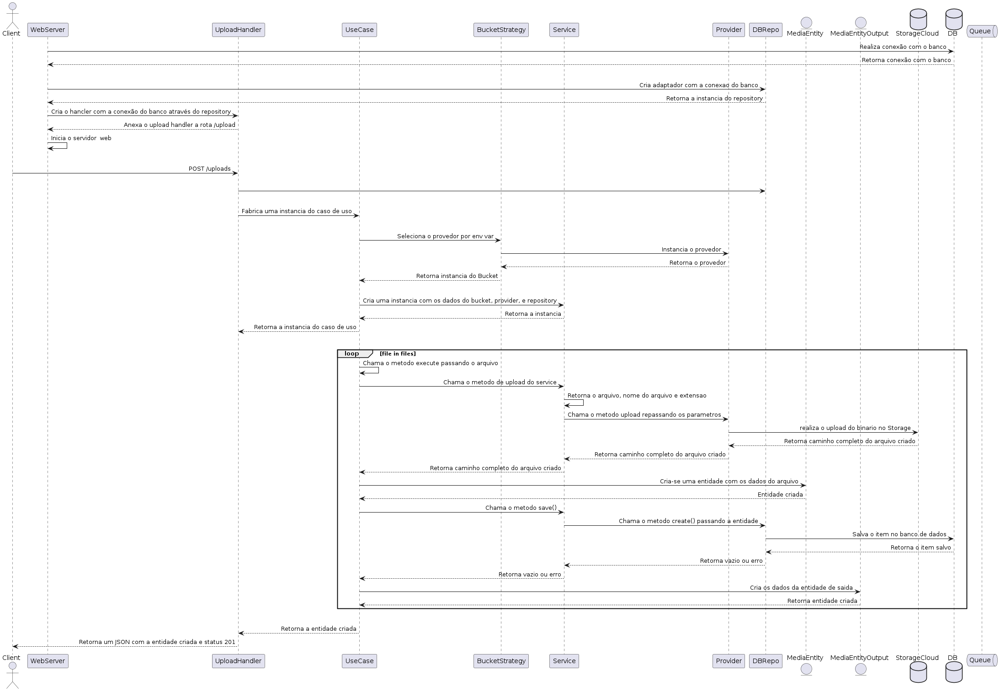

# Upload de Medias <golang-upload-api>

This service aims to upload medias (images, documents, videos and audios...) to the main cloud storages (aws s3, google storage, digital ocean spaces, cloudinary...). Like a media center


## Class diagram



## Sequence diagram



# Development

Locally, I recommend `ubuntu` or `debian` linux:

1. Golang v1.19
2. Git
3. Docker
4. Runs `go mod tidy`
5. Copy the `.env.sample` and create the `.env` file with your credentials

then runs:

```
go run main http
```

Docker:

1. [Install Docker](https://docs.docker.com/engine/install/ubuntu)
2. [Install Docker compose](https://docs.docker.com/compose/install)

and all you need to run is ...

```
$ docker-compose up http
```

# Testing

For test your application you need to run `docker-compose run --rm test` and this command will use the correctly environment
