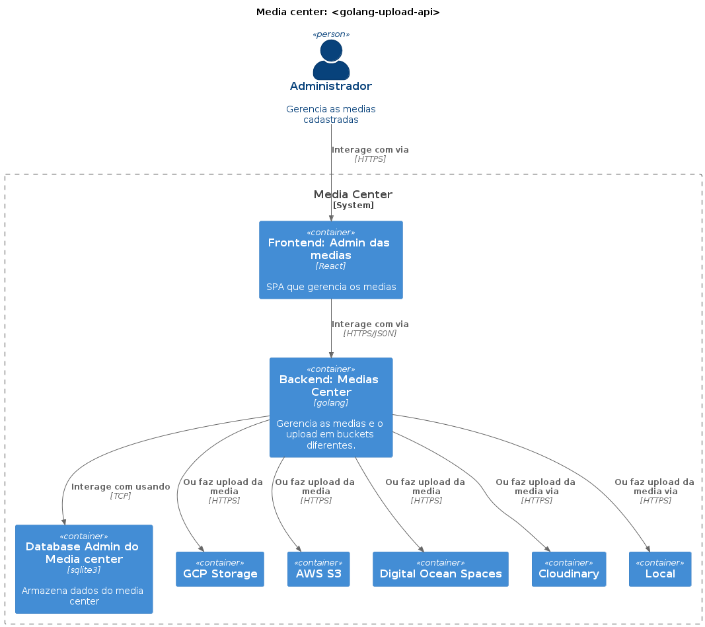

# Upload de Medias <golang-upload-api>

This service aims to upload medias (images, documents, videos and audios...) to the main cloud storages (aws s3, google storage, digital ocean spaces, cloudinary...). Like a media center



## Class diagram


## Sequence diagram


## How to configure providers

A short description to confgure storage providers

### Digital Ocean

[Create Token](https://cloud.digitalocean.com/account/api/tokens)


Then [create a space](https://cloud.digitalocean.com/spaces)


After that fill the env vars

```ini
DO_SPACE_ENDPOINT=BUCKET_ENDPOINT
; check your region in the endpoint url
DO_SPACE_REGION='sfo2'
DO_SPACE_NAME=DO_SPACE_NAME
DO_ACCESS_KEY=YOUR_SPACE_ACCESS_KEY
DO_SECRET_KEY=YOUR_SPACE_SECRET_KEY
```

### GCP

[Create service account](https://console.cloud.google.com/iam-admin/serviceaccounts) with role `cloud storage: admin objects`


Then generate the credential and save it on your computer


Create a bucket with public access and add `allUsers` permissions for get objects


After that fill the env vars

```ini
GOOGLE_APPLICATION_CREDENTIALS=YOUR_CREDENTIALS_PATH
GOOGLE_BUCKET_NAME=YOUR_BUCKET_NAME
```

# Development

Locally, I recommend `ubuntu` or `debian` linux:

1. Golang v1.19
2. Git
3. Docker
4. Runs `go mod tidy`
5. Copy the `.env.sample` and create the `.env` file with your credentials

then runs:

```
go run main http
```

Docker:

1. [Install Docker](https://docs.docker.com/engine/install/ubuntu)
2. [Install Docker compose](https://docs.docker.com/compose/install)

and all you need to run is ...

```
$ docker-compose up http
```

# Testing

For test your application you need to run `docker-compose run --rm test` and this command will use the correctly environment
